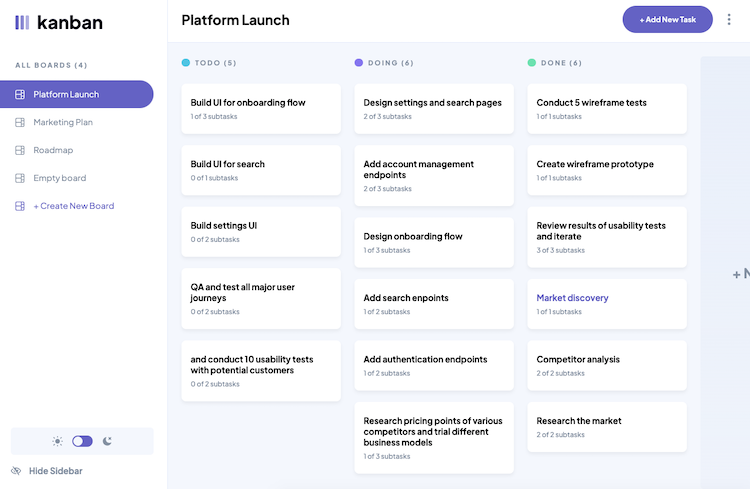

# Frontend Mentor - Kanban task management web app solution

This is a solution to the [Kanban task management web app challenge on Frontend Mentor](https://www.frontendmentor.io/challenges/kanban-task-management-web-app-wgQLt-HlbB). Frontend Mentor challenges help you improve your coding skills by building realistic projects. 

## Table of contents

- [Overview](#overview)
  - [The challenge](#the-challenge)
  - [Screenshot](#screenshot)
  - [Links](#links)
- [My process](#my-process)
  - [Built with](#built-with)
  - [What I learned](#what-i-learned)
- [Author](#author)
- [Acknowledgments](#acknowledgments)

## Overview

### The challenge

Users should be able to:

- View the optimal layout for the app depending on their device's screen size
- See hover states for all interactive elements on the page
- Create, read, update, and delete boards and tasks
- Receive form validations when trying to create/edit boards and tasks
- Mark subtasks as complete and move tasks between columns
- Hide/show the board sidebar
- Toggle the theme between light/dark modes
- **Bonus**: Allow users to drag and drop tasks to change their status and re-order them in a column
- **Bonus**: Keep track of any changes, even after refreshing the browser (`localStorage` could be used for this if you're not building out a full-stack app)
- **Bonus**: Build this project as a full-stack application

### Screenshot

### Links

- Solution URL: [https://github.com/K-ost/task-management-app](https://github.com/K-ost/task-management-app)
- Live Site URL: [Add live site URL here](https://your-live-site-url.com)

## My process

### Built with

- Semantic HTML5 markup
- CSS custom properties
- Flexbox
- Mobile-first workflow
- [React](https://reactjs.org/) - JS library
- [Redux Toolkit](https://redux-toolkit.js.org/) - For state manager
- [React Beautiful DnD](https://github.com/atlassian/react-beautiful-dnd) - Drag'n'drop ability
- [Styled Components](https://styled-components.com/) - For styles
- [React Hook Form](https://react-hook-form.com/) - For form validation

### What I learned

Working with React beautiful dnd was a new experience for me.

## Author

- Website - [K-ost](https://github.com/K-ost)
- Frontend Mentor - [@K-ost](https://www.frontendmentor.io/profile/K-ost)

## Acknowledgments

Hi, everyone!

This app is for client side only. It's made with using redux and LocalStorage of browser as a data storage. I had to change the data.json file a little bit, by adding ID's to boards, columns and tasks.

Of course, it's quite obvious, if it was a full stack application, it would be developed in a completely different way. The implementation of this app is just my opinion and vision of how it can be done and nothing more. The first thing that came to my mind.
